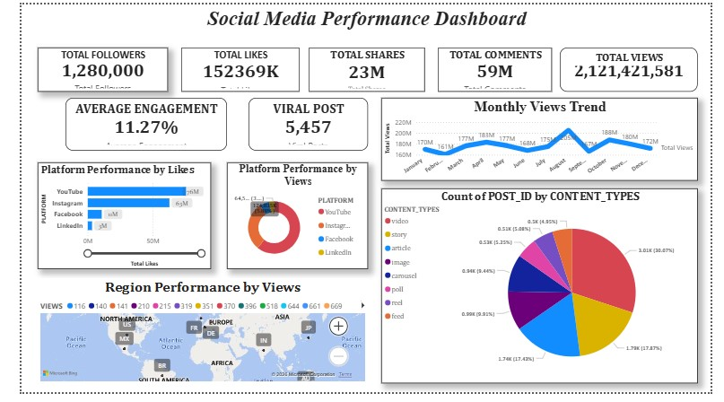
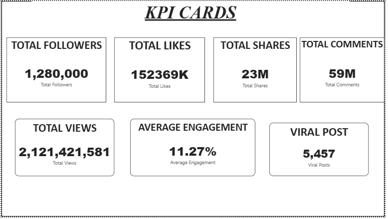
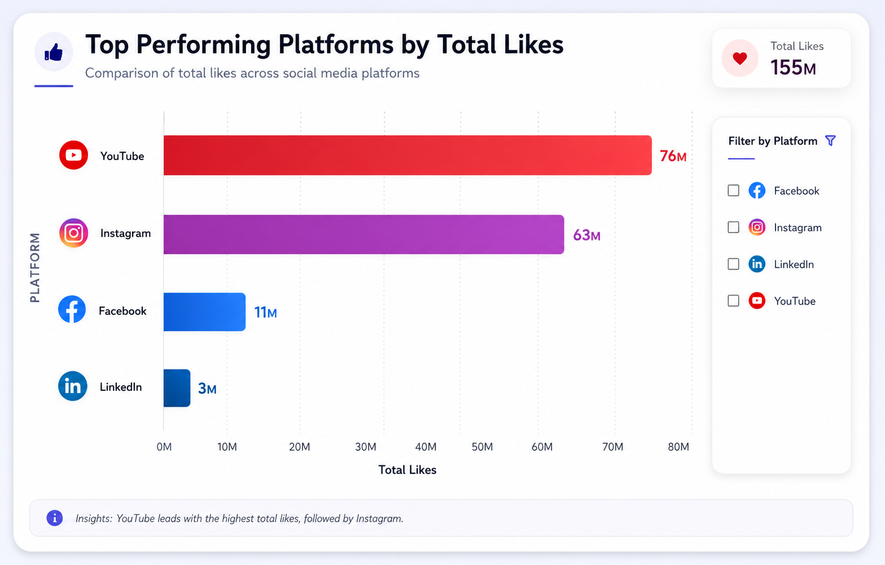
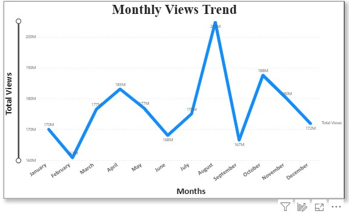
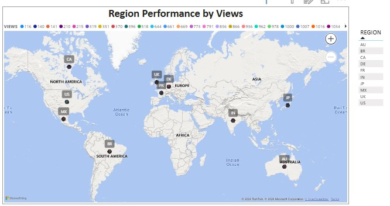
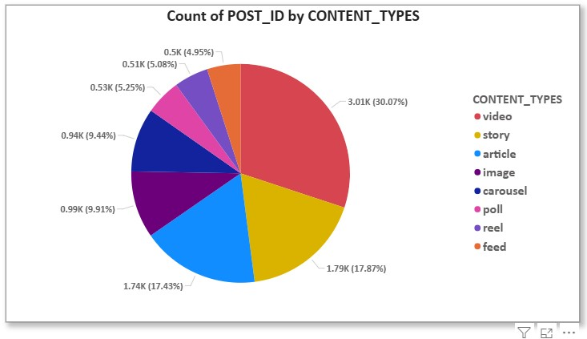

# 📊 Social Media Performance Dashboard

## 📸 Dashboard Screenshots

### Dashboard Overview



---

### KPI Dashboard



---

### Platform Performance Analysis



---

### Monthly Trend Analysis



---

### Region Analysis



---

### Content Analysis



---

## 📌 Project Overview

The **Social Media Performance Dashboard** is an end-to-end **Data Analytics & Business Intelligence project** built using **SQL** and **Power BI**.

This project analyzes social media performance metrics such as:

* Likes
* Views
* Comments
* Shares
* Engagement Rate
* Followers
* Viral Content
* Regional Performance
* Content Type Effectiveness

The project demonstrates a complete analytics workflow from raw data to interactive business intelligence dashboards.

---

# 🚀 Features

* Data Cleaning & Transformation
* SQL-Based Data Analysis
* Data Modeling
* DAX KPI Calculations
* Interactive Dashboard Design
* Business Insights Generation
* Multi-Page Reporting
* Portfolio-Ready BI Solution

---

# 🛠️ Tools & Technologies Used

| Tool        | Purpose                                  |
| ----------- | ---------------------------------------- |
| SQL (MySQL) | Data Cleaning, Transformation & Analysis |
| Power BI    | Dashboard Development & Visualization    |
| Power Query | Data Transformation                      |
| DAX         | KPI Measures & Calculations              |
| Excel / CSV | Source Dataset                           |

---

# 📂 Dataset Details

The dataset contains social media performance data from multiple platforms:

* Instagram
* Facebook
* LinkedIn
* YouTube

## Dataset Columns

* POST_ID
* PLATFORM
* FOLLOWERS
* CONTENT_TYPE
* TOPIC
* LANGUAGE
* REGION
* POST_DATETIME
* POST_DATE
* POST_TIME
* HASHTAGS
* SENTIMENT_SCORE
* LIKES
* VIEWS
* COMMENTS
* SHARES
* ENGAGEMENT_RATE
* IS_VIRAL
* ENGAGEMENT_LEVEL
* FOLLOWER_CATEGORY

---

# 🗄️ SQL Workflow

## 1️⃣ Database Creation

```sql
CREATE DATABASE SOCIAL_MEDIA_PERFORMANCE_DASHBOARD;
```

---

## 2️⃣ Data Exploration

Performed:

* Dataset exploration
* Table structure analysis
* Data type validation
* Record inspection

```sql
SELECT *
FROM social_media_performance_dataset;
```

---

## 3️⃣ Datetime Conversion

Converted text datetime into SQL DATETIME format.

```sql
UPDATE social_media_performance_dataset
SET post_datetime = STR_TO_DATE(post_datetime, '%m/%d/%Y %H:%i');
```

Created:

* POST_DATE
* POST_TIME

for improved analytics.

---

## 4️⃣ Data Cleaning

Performed:

* Null value checking
* Blank value checking
* Duplicate detection
* Invalid data validation
* Text trimming using `TRIM()`

```sql
SELECT *
FROM social_media_performance_dataset
WHERE platform IS NULL;
```

---

## 5️⃣ Feature Engineering

Created analytical columns such as:

### Engagement Level

```sql
CASE
    WHEN engagement_rate >= 0.50 THEN 'HIGH'
    WHEN engagement_rate >= 0.20 THEN 'MEDIUM'
    ELSE 'LOW'
END
```

### Follower Category

* INFLUENCER
* GROWING
* SMALL

---

# 📈 SQL Analysis Performed

## Platform Analysis

* Total posts by platform
* Average engagement by platform
* Total likes by platform
* Total shares by platform

## Viral Content Analysis

* Viral posts by platform
* Viral posts by region

## Content Performance Analysis

* Best content type by engagement
* Content performance metrics

## Time-Based Analysis

* Best posting hour
* Posts by month
* Best day by engagement

---

# 🧠 Advanced SQL Concepts Used

## HAVING Clause

```sql
HAVING AVG(likes) > 5000
```

## Subqueries

```sql
WHERE likes > (
    SELECT AVG(likes)
    FROM social_media_performance_dataset
)
```

## Window Functions

* ROW_NUMBER()
* RANK()
* DENSE_RANK()
* Running Totals

Example:

```sql
RANK() OVER (
    ORDER BY likes DESC
)
```

## Joins

Implemented:

* INNER JOIN
* LEFT JOIN

using a separate creators table.

---

# 📊 Power BI Workflow

## 1️⃣ Data Import

Imported cleaned dataset into Power BI Desktop.

---

## 2️⃣ Power Query Transformation

Performed:

* Data type correction
* Column renaming
* Date formatting
* Time formatting
* Data cleaning
* Column arrangement

---

## 3️⃣ DAX Measures Created

### Total Likes

```DAX
Total Likes = SUM('social_media_performance'[LIKES])
```

### Total Views

```DAX
Total Views = SUM('social_media_performance'[VIEWS])
```

### Total Comments

```DAX
Total Comments = SUM('social_media_performance'[COMMENTS])
```

### Total Shares

```DAX
Total Shares = SUM('social_media_performance'[SHARES])
```

### Average Engagement

```DAX
Average Engagement = AVERAGE('social_media_performance'[ENGAGEMENT_RATE])
```

### Viral Posts

```DAX
Viral Posts =
CALCULATE(
    COUNTROWS('social_media_performance'),
    'social_media_performance'[IS_VIRAL] = 1
)
```

---

# 📑 Dashboard Pages

## 📌 Dashboard Overview

Includes:

* KPI Cards
* Platform Performance Charts
* Monthly Trend Analysis
* Region Performance Map
* Content Type Distribution
* Interactive Slicers

---

## 📌 Platform Analysis

Analyzed:

* Likes by Platform
* Views by Platform
* Engagement by Platform
* Followers by Platform

---

## 📌 Trend Analysis

Visualized:

* Monthly Views Trend
* Engagement Trend
* Posting Activity Over Time

---

## 📌 Region Insights

Included:

* Region Performance Map
* Regional Engagement Comparison
* Viral Content Distribution

---

## 📌 Content Insights

Analyzed:

* Content Type Performance
* Viral Content Distribution
* Topic Analysis
* Sentiment Insights

---

# 🎯 Dashboard Features

## KPI Cards

The dashboard includes:

* Total Followers
* Total Likes
* Total Views
* Total Comments
* Total Shares
* Average Engagement Rate
* Viral Posts

---

## Interactive Slicers

Implemented slicers for:

* Platform
* Region
* Topic
* Viral Status
* Date

---

# 📊 Data Visualizations Used

* KPI Cards
* Bar Charts
* Line Charts
* Pie Charts
* Donut Charts
* Maps
* Slicers

---

# 💡 Business Insights Generated

* YouTube generated the highest views across platforms.
* Instagram showed strong engagement performance.
* Certain regions consistently produced viral content.
* High-engagement posts were associated with specific content types.
* Posting time significantly impacted engagement rate.

---

# 🧑‍💻 Skills Demonstrated

## SQL Skills

* Database creation
* Data cleaning
* Data transformation
* Aggregate functions
* GROUP BY & HAVING
* Subqueries
* Window functions
* Joins
* Analytical queries

## Power BI Skills

* Data modeling
* Power Query
* DAX calculations
* KPI development
* Dashboard design
* Interactive filtering
* Data storytelling
* Business intelligence reporting

---

# ✅ Project Outcome

Successfully developed a professional multi-page **Social Media Performance Dashboard** capable of:

* Tracking social media KPIs
* Monitoring engagement trends
* Comparing platform performance
* Identifying viral content
* Supporting business decision-making

This project demonstrates practical end-to-end Data Analytics and Business Intelligence workflow.

---

# 📁 GitHub Repository Structure

```bash
Social-Media-Performance-Dashboard/
│
├── README.md
├── social_media_dashboard.pbix
├── social_media_dataset.csv
├── transformed_dataset.xlsx
├── social_media_queries.sql
├── project_report.pdf
│
├── dashboard_overview.jpg
├── kpi_dashboard.jpg
├── platform_performance.jpg
├── monthly_trend.jpg
├── region_analysis.jpg
└── content_analysis.jpg
```

---

# 🔗 LinkedIn Project Description

🚀 Built a complete Social Media Performance Dashboard using SQL and Power BI.

## Key Highlights

* Performed data cleaning and transformation using SQL and Power Query
* Built DAX measures for KPI analysis
* Created interactive Power BI dashboards with slicers and maps
* Conducted platform, regional, engagement, and content analysis
* Used advanced SQL concepts including Joins, Subqueries, HAVING Clause, and Window Functions

## Tools Used

* SQL
* Power BI
* DAX
* Power Query
* Excel/CSV

#PowerBI #SQL #DataAnalytics #BusinessIntelligence #DataAnalyst #Dashboard

---

# 📌 Conclusion

This project demonstrates end-to-end Business Intelligence and Data Analytics capabilities using SQL and Power BI.

It highlights practical skills in:

* Data Cleaning
* Data Transformation
* Data Analysis
* Data Visualization
* Dashboard Development
* Business Intelligence Reporting

while delivering meaningful insights from social media performance data.
